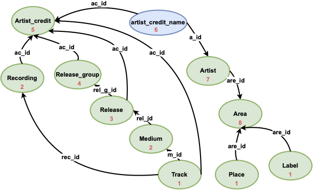

# ASPen: ASP-based Collective Entity Resolution

## Outline
- [Environment Installation](#environment-installation)
- [Experiment Running Instruction](#experiment-running-instruction)
  - [1 Similarity Filtering](#1-similarity-filtering)
  - [2 Main Results (only after Sim facts computed)](#2-main-results)
  - [3 Multi-level Recursion](#3-multi-level-recursion)
  - [4 Varying Duplicates Percentage](#4-varying-duplicates-percentage)
  - [5 Varying Sim Thresholds](#5-varying-sim-thresholds)
  - [6 Proof Tree](#6-proof-tree)
- [Clean Data Sampling](#clean-data-sampling)


## Environment Installation
Although it is suffice to install directly with `pip`, we recommand using a [`conda`](https://conda.io/projects/conda/en/latest/user-guide/install/index.html) environment as a container.
To do so, one could execute optionally the following:
- create a `conda` environment:
```
conda create -n aspen python=3.9.7
```
- activate the environment:
```
conda activate aspen
```

The running environment is maintained using `pip` based on `Python 3.9.7`. To install, directing first to the source folder `aspen/src` then executing the following:

```
pip install -r requirements.txt
```


## Experiment Running Instruction

A general explanantion of the command is the following:


```
python mains_explain_.py \
    --asprin "enable to use asprin for maximal solution"
    --cached "caching results or not"
    --enumerate 1 "enumerate the number of maximal solutions required if any"
    --schema "choosing dataset schema from {"dblp", "cora", "imdb", "music", "pokemon"}"
    --data "choosing version to use if music dataset, available choices:  {10, 30, 50, 50-corr, m10+1, m10+2, m10+3, m10+4}"
    --main "the main ER control function, enable if requiring ub/lb or maxsol"
    --rec-track "enable to compute levels"
    --getsim "enable to compute similarity facts on a dataset"
    --ub-guarded "enable to reuse precomputed upper-bound merge set"
    --presimed "enable to load precomputed similarity facts, otherwise runs online similarity evaluation"
    -m "directory where the optimisation statement locates" \
    -l "a list of asp program as input specification" \
    --typed_eval "activate evaluation for multi-relational dataset"
    --ternary "enable ternary representation of a specification (when domains of merge positions overlap)"
    --ub "compute upper-bound merge set"
    --lb "compute lower-bound merge set"
    --no_show "projection of merges without relation type (on dblp and cora)"
    --debug "enable to run in debug mode (with extra debugging logs)"
    --pos-merge "compute all PM input: all, verify a merge input c,c'"
    --trace-merge "input the merge to provide proof tree"
    --attr "input what relation and attribute the merge is belong to when explaining, e.g. release id"
    --naive-sim "enable to compute similarity on the sum of cross products of constants arcoss sim positions"
```


### 1 Similarity Computation
#### $$sim_\mathsf{opt}$$

```
# dblp
python -u mains_explain_.py -c -l ./experiment/aspen/dblp/dblp.lp  --getsim --typed_eval --no_show --ternary --schema dblp
# cora
python -u mains_explain_.py -c -l ./experiment/aspen/cora/cora.lp  --getsim --typed_eval --no_show --ternary --schema cora
# imdb
python -u mains_explain_.py -c -l ./experiment/aspen/imdb/imdb.lp  --getsim --typed_eval --ternary --schema imdb
# music
python -u mains_explain_.py -c -l ./experiment/aspen/music/music.lp  --getsim --typed_eval --ternary --schema music --data 50
# music-corr
python -u mains_explain_.py -c -l ./experiment/aspen/music/music-corr.lp  --getsim --typed_eval --ternary --schema music --data 50-corr
# pokemon
python -u mains_explain_.py -c -l ./experiment/aspen/pokemon/pokemon.lp  --getsim --typed_eval --ternary --schema pokemon

```

#### #### $$sim_\mathsf{cs}$$
```
# dblp
python -u mains_explain_.py -c -l ./experiment/aspen/dblp/dblp.lp  --naive-sim  --typed_eval --no_show --ternary --schema dblp
# cora
python -u mains_explain_.py -c -l ./experiment/aspen/cora/cora.lp  --naive-sim  --typed_eval --no_show --ternary --schema cora
# imdb
python -u mains_explain_.py -c -l ./experiment/aspen/imdb/imdb.lp  --naive-sim --typed_eval --ternary --schema imdb
# music
python -u mains_explain_.py -c -l ./experiment/aspen/music/music.lp  --naive-sim  --typed_eval --ternary --schema music --data 50
# music-corr
python -u mains_explain_.py -c -l ./experiment/aspen/music/music-corr.lp  --naive-sim  --typed_eval --ternary --schema music --data 50-corr
# pokemon
python -u mains_explain_.py -c -l ./experiment/aspen/pokemon/pokemon.lp  --naive-sim  --typed_eval --ternary --schema pokemon

```


### 2 Main Results
**(after Sim facts computed)**
```
# dblp
## lb
python -u mains_explain_.py -c -l ./experiment/aspen/dblp/dblp.lp   --main --lb --no_show --ternary --presimed --schema dblp --ub-guarded
## ub
python -u mains_explain_.py -c -l ./experiment/aspen/dblp/dblp.lp   --main --ub --no_show --ternary --presimed --schema dblp
## maxsol
python -u mains_explain_.py -c -l ./experiment/aspen/dblp/dblp.lp -a -m ./experiment/aspen/maxsol-eqr.lp --main  --no_show --ternary --presimed --schema dblp --ub-guarded
## possible merge
python -u mains_explain_.py -c -l ./experiment/aspen/dblp/dblp.lp  --pos-merge all --ternary --no_show --presimed --schema dblp --ub-guarded


# cora
## lb
python -u mains_explain_.py -c -l ./experiment/aspen/cora/cora.lp   --main --lb --no_show --ternary --presimed --schema cora --ub-guarded
## ub
python -u mains_explain_.py -c -l ./experiment/aspen/cora/cora.lp   --main --ub --no_show --ternary --presimed --schema cora
## maxsol
python -u mains_explain_.py -c -l ./experiment/aspen/cora/cora.lp -a -m ./experiment/aspen/maxsol-eqr.lp --main  --no_show --ternary --presimed --schema cora --ub-guarded
## possible merge
python -u mains_explain_.py -c -l ./experiment/aspen/cora/cora.lp  --pos-merge all --ternary --no_show --presimed --schema cora --ub-guarded


# imdb
## lb
python -u mains_explain_.py -c -l ./experiment/aspen/imdb/imdb.lp   --main --lb --ternary --presimed --schema imdb --typed_eval --ub-guarded
## ub
python -u mains_explain_.py -c -l ./experiment/aspen/imdb/imdb.lp   --main --ub  --ternary --presimed --schema imdb --typed_eval --ub-guarded
## maxsol
python -u mains_explain_.py -c -l ./experiment/aspen/imdb/imdb.lp -a -m ./experiment/aspen/maxsol-eqr.lp --main  --ternary --presimed --schema imdb --typed_eval --ub-guarded
## possible merge
python -u mains_explain_.py -c -l ./experiment/aspen/imdb/imdb.lp  --pos-merge all --ternary --presimed --schema imdb --typed_eval --ub-guarded


# music
## lb
python -u mains_explain_.py -c -l ./experiment/aspen/music/music.lp   --main --lb --ternary --presimed --schema music --typed_eval --data 50 --ub-guarded
## ub
python -u mains_explain_.py -c -l ./experiment/aspen/music/music.lp   --main --ub  --ternary --presimed --schema music --typed_eval --data 50 --ub-guarded
## maxsol
python -u mains_explain_.py -c -l ./experiment/aspen/music/music.lp -a -m ./experiment/aspen/maxsol-eqr.lp --main  --ternary --presimed --schema music --typed_eval  --data 50 --ub-guarded
## possible merge
python -u mains_explain_.py -c -l ./experiment/aspen/music/music.lp  --pos-merge all --ternary --presimed --schema music --typed_eval --data 50 --ub-guarded


# music-corr
## lb
python -u mains_explain_.py -c -l ./experiment/aspen/music/music-corr.lp   --main --lb --ternary --presimed --schema music --typed_eval --data 50-corr --ub-guarded
## ub
python -u mains_explain_.py -c -l ./experiment/aspen/music/music-corr.lp   --main --ub  --ternary --presimed --schema music --typed_eval --data 50-corr --ub-guarded
## maxsol
python -u mains_explain_.py -c -l ./experiment/aspen/music/music-corr.lp -a -m ./experiment/aspen/maxsol-eqr.lp --main  --ternary --presimed --schema music --typed_eval  --data 50-corr --ub-guarded
## possible merge
python -u mains_explain_.py -c -l ./experiment/aspen/music/music-corr.lp  --pos-merge all --ternary --presimed --schema music --typed_eval --data 50-corr --ub-guarded


# pokemon
## lb
python -u mains_explain_.py -c -l ./experiment/aspen/pokemon/pokemon.lp   --main --lb --ternary --presimed --schema pokemon --typed_eval --ub-guarded
## ub
python -u mains_explain_.py -c -l ./experiment/aspen/pokemon/pokemon.lp   --main --ub  --ternary --presimed --schema pokemon --typed_eval --ub-guarded
## maxsol
python -u mains_explain_.py -c -l ./experiment/aspen/pokemon/pokemon.lp -a -m ./experiment/aspen/maxsol-eqr.lp --main  --ternary --presimed --schema pokemon --typed_eval --ub-guarded
## possible merge
python -u mains_explain_.py -c -l ./experiment/aspen/pokemon/pokemon.lp  --pos-merge all --ternary --presimed --schema pokemon --typed_eval --ub-guarded

```


### 3 Multi-level Recursion

```
# imdb

## ub
python -u mains_explain_.py -c -l ./experiment/aspen/imdb/imdb.lp  --typed_eval --ub --presimed --ternary --rec-track --schema imdb
## maxsol
python -u mains_explain_.py -c -l ./experiment/aspen/imdb/imdb.lp -a -m ./experiment/aspen/maxsol-eqr.lp -rec-track  --ternary --presimed --schema imdb --typed_eval


# music
## ub
python -u mains_explain_.py -c -l ./experiment/aspen/music/music.lp   --rec-track  --ub  --ternary --presimed --schema music --typed_eval --data 50
## maxsol
python -u mains_explain_.py -c -l ./experiment/aspen/music/music.lp -a -m ./experiment/aspen/maxsol-eqr.lp -rec-track  --ternary --presimed --schema music --typed_eval  --data 50


# music-corr
## ub
python -u mains_explain_.py -c -l ./experiment/aspen/music/music-corr.lp   --rec-track  --ub  --ternary --presimed --schema music --typed_eval --data 50-corr
## maxsol
python -u mains_explain_.py -c -l ./experiment/aspen/music/music-corr.lp -a -m ./experiment/aspen/maxsol-eqr.lp -rec-track  --ternary --presimed --schema music --typed_eval  --data 50-corr


# pokemon
## ub
python -u mains_explain_.py -c -l ./experiment/aspen/pokemon/pokemon.lp   --rec-track  --ub  --ternary --presimed --schema pokemon --typed_eval
## maxsol
python -u mains_explain_.py -c -l ./experiment/aspen/pokemon/pokemon.lp -a -m ./experiment/aspen/maxsol-eqr.lp -rec-track  --ternary --presimed --schema pokemon --typed_eval

```


### 4 Varying Duplicates Percentage $$\mathsf{Du}$$
#### Step 1: sim computing
- For Dup30
`python -u mains_explain_.py -c -l ./experiment/aspen/music/music.lp  --getsim --typed_eval --ternary --schema music --data 30`

- For Dup10
`python -u mains_explain_.py -c -l ./experiment/aspen/music/music.lp  --getsim --typed_eval --ternary --schema music --data 10`

#### Step 2: derive solutions

```
# music 30
## lb
python -u mains_explain_.py -c -l ./experiment/aspen/music/music.lp   --main --lb --ternary --presimed --schema music --typed_eval --data 30 --ub-guarded
## ub
python -u mains_explain_.py -c -l ./experiment/aspen/music/music.lp   --main --ub  --ternary --presimed --schema music --typed_eval --data 30 --ub-guarded
## maxsol
python -u mains_explain_.py -c -l ./experiment/aspen/music/music.lp -a -m ./experiment/aspen/maxsol-eqr.lp --main  --ternary --presimed --schema music --typed_eval  --data 30 --ub-guarded
## possible merge
python -u mains_explain_.py -c -l ./experiment/aspen/music/music.lp  --pos-merge all --ternary --presimed --schema music --typed_eval --data 30 --ub-guarded


# music 10
## lb
python -u mains_explain_.py -c -l ./experiment/aspen/music/music.lp   --main --lb --ternary --presimed --schema music --typed_eval --data 10 --ub-guarded
## ub
python -u mains_explain_.py -c -l ./experiment/aspen/music/music.lp   --main --ub  --ternary --presimed --schema music --typed_eval --data 10 --ub-guarded
## maxsol
python -u mains_explain_.py -c -l ./experiment/aspen/music/music.lp -a -m ./experiment/aspen/maxsol-eqr.lp --main  --ternary --presimed --schema music --typed_eval  --data 10 --ub-guarded
## possible merge
python -u mains_explain_.py -c -l ./experiment/aspen/music/music.lp  --pos-merge all --ternary --presimed --schema music --typed_eval --data 10 --ub-guarded

```


### 5 Varying Sim Thresholds $$\delta$$
#### Step 1: sim computing
For $$\delta \in \{98,95,90,85\}$$

execute

`python -u mains_explain_.py -c -l ./experiment/aspen/music/thresh/music-{\delta}.lp  --getsim --typed_eval --ternary --schema music --data 50`


#### Step 2: derive solutions

For $$\delta \in \{98,95,90,85\}$$

execute
```
## lb
python -u mains_explain_.py -c -l ./experiment/aspen/music/thresh/music-{\delta}.lp   --main --lb --ternary --presimed --schema music --typed_eval --data 50
## ub
python -u mains_explain_.py -c -l ./experiment/aspen/music/thresh/music-{\delta}.lp   --main --ub  --ternary --presimed --schema music --typed_eval --data 50
## maxsol
python -u mains_explain_.py -c -l ./experiment/aspen/music/thresh/music-{\delta}.lp -a -m ./experiment/aspen/maxsol-eqr.lp --main  --ternary --presimed --schema music --typed_eval  --data 50
## possible merge
python -u mains_explain_.py -c -l ./experiment/aspen/music/thresh/music-{\delta}.lp  --pos-merge all --ternary --presimed --schema music --typed_eval --data 50

```


### 6 Varying Data Size $$|D|$$
#### Step 1: sim computing
For $$|D| \in \{1,2,3,4\}$$

execute

`python -u mains_explain_.py -c -l ./experiment/aspen/music/music.lp  --getsim --typed_eval --ternary --schema music --data m10+{|D|}`


#### Step 2: derive solutions

For $$|D| \in \{1,2,3,4\}$$

execute
```
## lb
python -u mains_explain_.py -c -l ./experiment/aspen/music/music.lp   --main --lb --ternary --presimed --schema music --typed_eval --data m10+{|D|} --ub-guarded
## ub
python -u mains_explain_.py -c -l ./experiment/aspen/music/music.lp   --main --ub  --ternary --presimed --schema music --typed_eval  --data m10+{|D|} --ub-guarded
## maxsol
python -u mains_explain_.py -c -l ./experiment/aspen/music/music.lp -a -m ./experiment/aspen/maxsol-eqr.lp --main  --ternary --presimed --schema music --typed_eval   --data m10+{|D|} --ub-guarded
## possible merge
python -u mains_explain_.py -c -l ./experiment/aspen/music/music.lp  --pos-merge all --ternary --presimed --schema music --typed_eval  --data m10+{|D|} --ub-guarded

```

### 7 Datalog Approx.
Set up `VLog4j` environments following the [instructions](https://github.com/knowsys/rulewerk), then for each database $$D\in\{\text{dblp, cora, imdb, music, music-corr, pokemon}}$$ execute the following,
```
echo -e "@load './encoding/datalogs/{D}-{pname}.rls' .\n @reason .\n @query merge(?R,?X,?Y) ." | java -jar /encoding/datalogs/rulewerk.jar
```

where `pname`$$\in \{lb, ub\}$$.


### 6 Proof Tree
#### 1) Supported Merge (-pos-merge can be replaced by any pair)
```
python -u mains_explain_.py -c -l ./experiment/aspen/music/music.lp --pos-merge rec-2489115-dup-1,rec-2489115-dup-0 --attr release,release --trace  --ternary --presimed --typed_eval --schema music --data 50
```

#### 2) Unsupported Merge (-pos-merge can be replaced by any pair)
```
python -u mains_explain_.py -c -l ./experiment/aspen/music/music.lp --pos-merge rec-2489115-dup-1,id-748010  --attr release,release --trace  --ternary --presimed --typed_eval --schema music --data 50
```

#### 3) Violated Merge (-pos-merge can be replaced by any pair)
```
python -u mains_explain_.py -c -l ./experiment/aspen/music/music.lp --pos-merge id-748086,id-748010   --attr release,release --trace  --ternary --presimed --typed_eval --schema music --data 50
```


## Clean Data Sampling
 We describe the process of data sampling and synthesising duplication for the MUSIC and POKEMON datasets. Note that it is important to preserve between entities from different relations when corrupting the instances to retain interdependencies of the data.

Thus we take into consideration the referential dependency graphs of schema when creating the datasets. Assuming the original schema instances of the MUSIC and POKEMON 
are clean, we sampled tuples from each table and created clean partitions of the instances. In particular, we started from the relations with zero in-degree and sampled for each step the adjacent referenced entity relations that have all their referencing relations sampled. Since tuples from non-entity relations store only foreign keys and do not any identifier, stand alone are meaningless, 
they were sampled only after one of their referencing relations are done with sampling. 

As seen in figure below, green nodes and blue nodes represent entity and non-entity relations respectively in the MUSIC schema, each edge indicates a referential constraints from an out-node to an in-node labelled with the corresponding foreign key. In this case, we begin sampling from the entity relations `Track`, `Place`, `Label` since they are not referenced by any other relations. As `Artist_Credit` relation is also referenced by many other relations, in the second step we sample only those are adjacent to `Track` and with all in-arrows sampled, i.e., the `Medium` and `Recording` relations. Entities of other relations are sampled analogously. Note that since the non-entity relation `Artist_Credit_Name` stores mappings between  `Artist_Credit` and `Artist`, it is sampled only after the entities of `Artist_Credit` are picked. We are then able to proceed sampling from `Artist` when `Artist_Credit_Name` is selected. Consequently, clean partitions of the schema instances can be obtained from sampling. The sampling procedure is done by an extra ASP program as a part of data preprocessing step.


